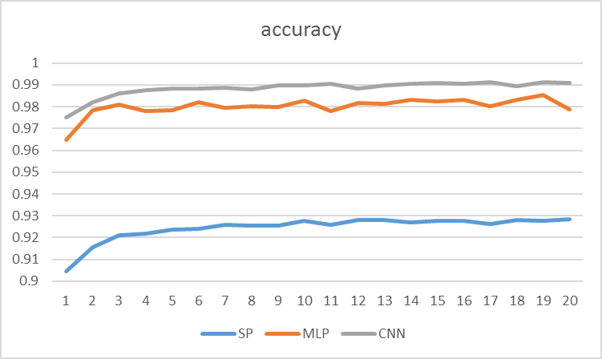

##概要

Chainer の MNIST を使ったサンプルスクリプトを拡張し、単純パーセプトロン (SP)、多層パーセプトロン (MLP)、畳み込みニューラルネットワーク (CNN) の "accuracy" と "loss" を比較しました。

##ニューラルネットワーク

MNIST サンプルに付属の net.py に SP と CNN 用のクラスを追加しました。

```
import chainer
import chainer.functions as F
import chainer.links as L

class MnistMLP(chainer.Chain):

    """An example of multi-layer perceptron for MNIST dataset.

    This is a very simple implementation of an MLP. You can modify this code to
    build your own neural net.

    """
    def __init__(self, n_in=784, n_units=1000, n_out=10):
        super(MnistMLP, self).__init__(
            l1=L.Linear(n_in, n_units),
            l2=L.Linear(n_units, n_units),
            l3=L.Linear(n_units, n_out),
        )

    def __call__(self, x):
        h1 = F.relu(self.l1(x))
        h2 = F.relu(self.l2(h1))
        return self.l3(h2)


class MnistMLPParallel(chainer.Chain):

    """An example of model-parallel MLP.

    This chain combines four small MLPs on two different devices.

    """
    def __init__(self, n_in, n_units, n_out):
        super(MnistMLPParallel, self).__init__(
            first0=MnistMLP(n_in, n_units // 2, n_units).to_gpu(0),
            first1=MnistMLP(n_in, n_units // 2, n_units).to_gpu(1),
            second0=MnistMLP(n_units, n_units // 2, n_out).to_gpu(0),
            second1=MnistMLP(n_units, n_units // 2, n_out).to_gpu(1),
        )

    def __call__(self, x):
        # assume x is on GPU 0
        x1 = F.copy(x, 1)

        z0 = self.first0(x)
        z1 = self.first1(x1)

        # sync
        h0 = z0 + F.copy(z1, 0)
        h1 = z1 + F.copy(z0, 1)

        y0 = self.second0(F.relu(h0))
        y1 = self.second1(F.relu(h1))

        # sync
        y = y0 + F.copy(y1, 0)
        return y

class MnistSP(chainer.Chain):

    """An example of simple perceptron for MNIST dataset.

    """
    def __init__(self, n_in=784, n_out=10):
        super(MnistSP, self).__init__(
            l1=L.Linear(n_in, n_out),
        )

    def __call__(self, x):
        # param x --- chainer.Variable of array
        return self.l1(x)

class MnistCNN(chainer.Chain):

    """An example of convolutional neural network for MNIST dataset.
       refered page:
       http://ttlg.hateblo.jp/entry/2016/02/11/181322

    """

    def __init__(self, channel=1, c1=16, c2=32, c3=64, f1=256, \
                 f2=512, filter_size1=3, filter_size2=3, filter_size3=3):
        super(MnistCNN, self).__init__(
            conv1=L.Convolution2D(channel, c1, filter_size1),
            conv2=L.Convolution2D(c1, c2, filter_size2),
            conv3=L.Convolution2D(c2, c3, filter_size3),
            l1=L.Linear(f1, f2),
            l2=L.Linear(f2, 10)
        )

    def __call__(self, x):
        # param x --- chainer.Variable of array
        x.data = x.data.reshape((len(x.data), 1, 28, 28))
        h = F.relu(self.conv1(x))
        h = F.max_pooling_2d(h, 2)
        h = F.relu(self.conv2(h))
        h = F.max_pooling_2d(h, 2)
        h = F.relu(self.conv3(h))
        h = F.max_pooling_2d(h, 2)
        h = F.dropout(F.relu(self.l1(h)))
        y = self.l2(h)
        return y


```

## 結果

ざっくりいうと、accuracy (高いほど良い)では SP が 0.93、MLP が 0.98、CNN が 0.99。
loss (低いほど良い)では SP が 0.26、MLP が 0.1、CNN が 0.05。

というわけで MNIST の手書き数字の認識において、今回検証した中では CNN が最も優れた方式だということがわかりました。



